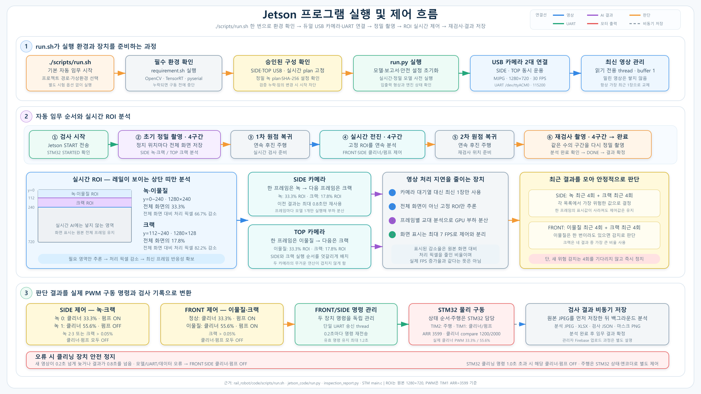

# Jetson AI·로봇 제어

이 폴더에는 두 대의 카메라 영상을 분석하고 STM32와 통신해 축소 테스트베드의 주행·클리너·워터펌프를 제어하는 Jetson 런타임이 담겨 있습니다.

> 카메라 분석은 녹·크랙·이물질 후보를 선별하기 위한 기능이며 구조 안전을 판정하지 않습니다.

## 담당 역할

```text
SIDE/TOP 카메라
        │
        ▼
최신 프레임 유지 → TensorRT 추론 → 최근 결과 기반 판단
        │                         ├─ JPEG·XLSX 보고서
        │                         └─ JSON·PNG 대시보드 자료
        ▼ UART
STM32F103 → 주행 모터 · 전면/측면 클리너 · 워터펌프
```

| 구성 | 역할 |
| --- | --- |
| SIDE(측면) 카메라 | 녹·크랙 후보 분석과 초기/재검사 촬영 |
| TOP(상단) 카메라 | 크랙 후보·이물질 분석과 초기/재검사 촬영 |
| Jetson Orin Nano | TensorRT 추론, 모델 이력 판단, 검사 결과 생성 |
| STM32F103 | UART 명령을 실제 구동부 출력으로 변환 |

## 소프트웨어 모드

| 모드 | 발표·시험에서의 역할 | 실제 UART 출력 |
| --- | --- | --- |
| 학습 사진 촬영 | 동일 카메라로 모델 보강용 원본 이미지 수집 | 없음 |
| 정지 캡처 검사 | 1280×720 전체 프레임의 녹·크랙 후보 확인 | 없음 |
| 단일 카메라 실시간 검사 | ROI 분석, 화면 지연과 제어 판단 확인 | 모의 출력 |
| SIDE/TOP 통합 검사 | 두 카메라와 네 분석 역할의 동시 동작 확인 | 선택 |
| 전체 임무 | 초기 검사 → 이동·청소 → 재검사 → 보고서 생성 | 사용 |



*그림 1. 실행 환경 확인, 두 카메라 운용, 실시간 분석, STM32 제어와 검사 기록의 전체 흐름*

## 카메라별 분석

| 카메라 | 정지 캡처 | 실시간 ROI |
| --- | --- | --- |
| SIDE | 1280×720 녹·크랙 후보 | 상단 240px 녹, 일부 중첩 구간 크랙 |
| TOP | 1280×720 크랙 후보 | 상단 240px 이물질, 일부 중첩 구간 크랙 |

실시간 경로는 처리 중인 프레임이 쌓이지 않도록 최신 프레임을 유지합니다. 녹·크랙·이물질 모델은 한 번의 결과가 아니라 모델별 최근 4회 결과와 입력·추론 결과의 최신성을 함께 확인합니다.

활성 모델의 역할, 입력 크기와 배포 상태는 [모델 상태표](../docs/MODEL_STATUS.md)에 정리되어 있습니다. ONNX와 TensorRT plan은 Jetson·TensorRT 버전에 종속되므로 저장소에는 포함하지 않습니다.

## 제어 판단

- 크랙 후보 마스크가 ROI의 **0.05%**를 넘으면 해당 위치의 클리너와 워터펌프를 정지합니다.
- 녹은 최근 결과 중 가장 높은 단계를, 이물질은 최근 결과 중 한 번이라도 검출된 상태를 반영합니다.
- 최초 결과 미준비, 새 위험 또는 런타임·UART 오류에서는 청소 출력을 정지합니다.
- 일시적인 결과 공백에는 직전의 검증된 명령만 최대 1.2초 유지하며, 이후에도 회복되지 않으면 정지합니다.

| 위치 | 상태 | 클리너 | 워터펌프 |
| --- | --- | ---: | --- |
| 전면 | 이물질 없음 | 33.3% | ON |
| 전면 | 이물질 있음 | 55.6% | ON |
| 측면 | 녹 0단계 | 33.3% | ON |
| 측면 | 녹 1단계 | 55.6% | OFF |
| 측면 | 녹 2·3단계 | OFF | OFF |

클리너 출력은 STM32 TIM1의 3600 count 주기에서 compare 1200과 2000을 사용하므로 실제 duty는 각각 33.3%와 55.6%입니다.

## 검사 결과

| 산출물 | 포함 정보 |
| --- | --- |
| JPEG | 초기/재검사의 SIDE/TOP 원본·분석 이미지 |
| XLSX | 사진별 녹 등급·점유율과 크랙 후보 비율 |
| JSON | 실행·카메라·모델 출처·분석 상태·전후 요약 |
| PNG | 글자와 UI가 없는 녹·크랙 마스크 미리보기 |

대시보드 자료 생성은 검사 결과를 보여주기 위한 보조 경로이며 로봇의 모터·펌프 제어 입력으로 사용하지 않습니다.

## 현재 범위

- 카메라, TensorRT 추론, UART와 구동부를 연결한 축소 테스트베드 런타임입니다.
- 캡처용 녹 hard-negative 모델과 5채널 경량 듀얼헤드는 연구·비교 후보이며 정상 임무 기준과 구분됩니다.
- 조명, 재질, 각도와 학습 분포 밖 배경에서는 오탐·미탐이 발생할 수 있습니다.
- 상세 학습 코드는 [`data_training`](../data_training/README_KR.md), 결과 조회 화면은 [`dashboard`](../dashboard/README.md)에 정리되어 있습니다.
