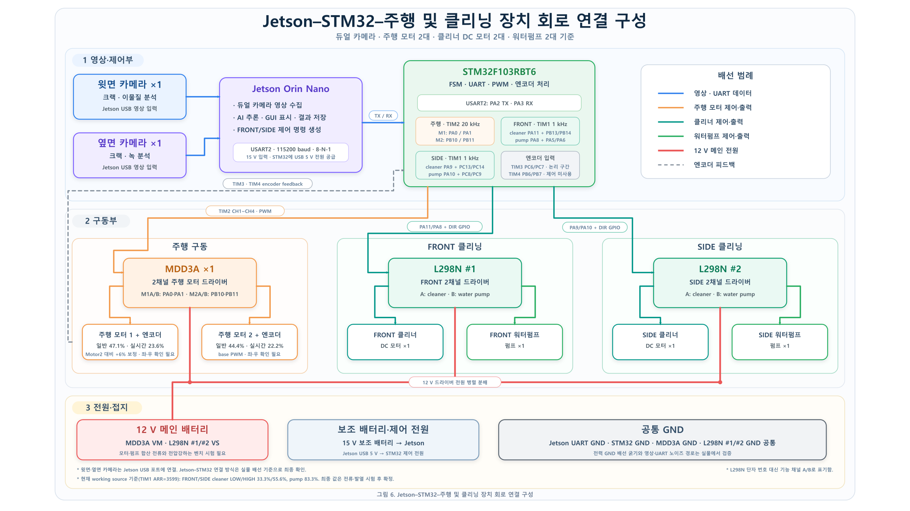

# STM32 제어 펌웨어

이 펌웨어는 Jetson의 검사·제어 판단을 받아 축소 레일 로봇의 주행부와 전면/측면 청소 장치를 구동합니다. 영상 추론은 Jetson이 담당하고, STM32는 UART 통신, 엔코더 기반 구간 이동, PWM 출력과 액추에이터 정지를 담당합니다.

## 펌웨어 역할

- `STM32F103RB`에서 주행 모터, FRONT/SIDE 클리너와 워터펌프를 제어합니다.
- 주 엔코더로 레일 구간 이동과 정지 시점을 판단하고 카메라 촬영 신호를 Jetson에 전달합니다.
- Jetson이 보낸 FRONT/SIDE별 클리너·펌프 명령을 각 출력에 독립적으로 적용합니다.
- 리셋, 허용되지 않은 상태, UART 수신 오류 또는 액추에이터 명령 제한시간 초과 시 청소 출력을 정지합니다.

## 하드웨어 구성

| 구분 | 현재 구성 |
| --- | --- |
| 제어 보드 | NUCLEO-F103RB (`STM32F103RB`) |
| Jetson 통신 | ST-LINK USB 가상 COM, USART2, 115200 baud, 8-N-1 |
| 주행 출력 | TIM2 PWM 4채널로 두 주행 모터의 정·역방향 제어 |
| 주 엔코더 | TIM3 CH1/CH2, 이동 구간 판단에 사용 |
| 보조 엔코더 | TIM4 CH1/CH2, 현재는 진단 피드백용 |
| 청소 출력 | TIM1 PWM 4채널로 FRONT/SIDE 클리너와 워터펌프 제어 |

| 역할 | 장치 | PWM 출력 | 방향 GPIO |
| --- | --- | --- | --- |
| FRONT | 클리너 | PA11 / TIM1 CH4 | PB13, PB14 |
| FRONT | 워터펌프 | PA8 / TIM1 CH1 | PA5, PA6 |
| SIDE | 클리너 | PA9 / TIM1 CH2 | PC13, PC14 |
| SIDE | 워터펌프 | PA10 / TIM1 CH3 | PC8, PC9 |

*그림 1. UART·PWM·엔코더·모터 드라이버·전원과 공통 접지를 포함한 연결 구성*

## 제어 흐름

1. 전원이 들어오면 주행 모터와 네 청소 출력을 정지한 상태로 대기합니다.
2. Jetson의 시작 명령을 받으면 구간별로 이동·정지하며 초기 검사 촬영을 요청합니다.
3. 초기 검사가 끝나면 출발 위치로 복귀하고 실시간 청소 구간을 주행합니다.
4. 실시간 구간에서는 Jetson의 FRONT/SIDE 판단에 따라 클리너와 워터펌프 출력을 갱신합니다.
5. 청소 후 같은 구간을 재검사하고 임무가 끝나면 모든 출력을 정지합니다.

## 출력 정책

TIM1은 `ARR=3599`이므로 3600 count가 한 주기입니다. 명령 이름과 화면 표시는 이 타이머의 실제 duty를 기준으로 합니다.

| 출력 | compare | 실제 PWM duty |
| --- | ---: | ---: |
| 클리너 기본 단계 (`PWM_33_3`) | 1200 | 33.3% |
| 클리너 강화 단계 (`PWM_55_6`) | 2000 | 55.6% |
| 워터펌프 ON | 3000 | 83.3% |
| OFF | 0 | 0% |

FRONT와 SIDE는 서로 다른 UART 명령과 제한시간을 사용합니다. 활성 클리너·펌프 명령이 1초 동안 갱신되지 않으면 해당 출력을 OFF로 전환합니다. 녹·크랙·이물질에 따른 단계 선택은 Jetson이 수행하며 STM32는 전달받은 출력 명령을 실행합니다.

## 현재 범위

`code/encoder`에는 STM32CubeIDE 프로젝트와 STM32F1 HAL/CMSIS 소스가 포함되어 있습니다. 현재 펌웨어는 전원 차단이 가능한 축소 테스트베드의 연구·시연용이며, 실제 속도·이동거리·회전수·유량은 연결된 모터와 구동계에 따라 달라지는 미확정 항목입니다. 보조 엔코더는 아직 주행 판정의 상호검증에 사용하지 않습니다.

전체 시스템은 [프로젝트 소개](../README.md)에, 현장 적용 전 필요한 보호 장치와 검증 범위는 [안전 및 시스템 한계](../docs/SAFETY_AND_LIMITATIONS.md)에 정리되어 있습니다.
